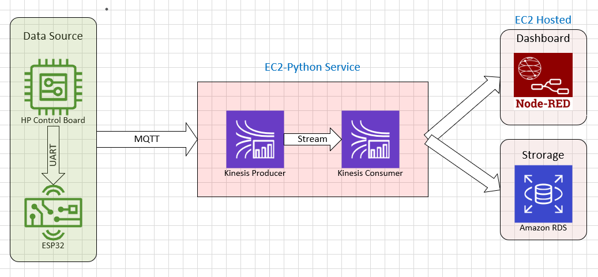

# Data Project Template

<a target="_blank" href="https://datalumina.com/">
    
</a>

## Project Organization

```
├── LICENSE            <- Open-source license if one is chosen
├── README.md          <- The top-level README for developers using this project
├── data
│   ├── external       <- Data from third party sources
│   ├── interim        <- Intermediate data that has been transformed
│   ├── processed      <- The final, canonical data sets for modeling
│   └── raw            <- The original, immutable data dump
│
├── models             <- Trained and serialized models, model predictions, or model summaries
│
├── notebooks          <- Jupyter notebooks. Naming convention is a number (for ordering),
│                         the creator's initials, and a short `-` delimited description, e.g.
│                         `1.0-jqp-initial-data-exploration`
│
├── references         <- Data dictionaries, manuals, and all other explanatory materials
│
├── reports            <- Generated analysis as HTML, PDF, LaTeX, etc.
│   └── figures        <- Generated graphics and figures to be used in reporting
│
└── src                         <- Source code for this project
    │
    ├── __init__.py             <- Makes src a Python module
    │
    ├── config.py               <- Store useful variables and configuration
    │
    ├── dataset.py              <- Scripts to download or generate data
    │
    ├── features.py             <- Code to create features for modeling
    │
    │
    ├── modeling
    │   ├── __init__.py
    │   ├── predict.py          <- Code to run model inference with trained models
    │   └── train.py            <- Code to train models
    │
    ├── plots.py                <- Code to create visualizations
    │
    └── services                <- Service classes to connect with external platforms, tools, or APIs
        └── __init__.py
```

## Project

# Data Monitoring System

The Sensor-to-Cloud Data Monitoring System is an intelligent IoT-based platform designed to collect, transmit, process, and visualize real-time data from a heatpump to a secure cloud environment. The system enables continuous monitoring of operational parameters such as temperature, pressure, pump rpm and flow rate.

The project integrates hardware sensors with LP5536 based control system and interfaces the control system to ESP32 based wifi data transmitter. Sensor data is transmitted securely to the cloud via MQTT message streaming protocol, where it the data is first transfomed and quality checked, then stored in AWS RDS (MySQL database) and displayed through a node-red dashboards.

## Key Features

1. Real-time sensor data acquisition
2. Secure sensor-to-cloud communication
3. Cloud database storage
4. Monitoring dashboard
5. Historical data logging and reporting
6. Remote monitoring and device management
7. Scalable architecture for multiple sensors and locations

## Architecture


